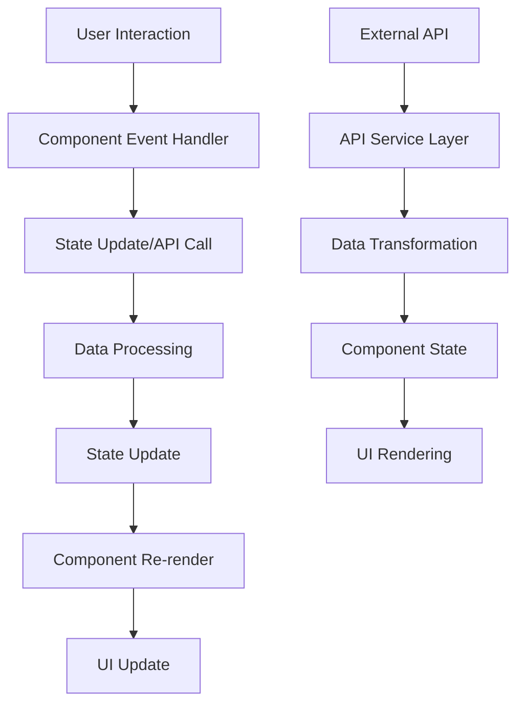

# Beer Finder App - Component Architecture

## Overview

This document outlines the component architecture for the Beer Finder App, a React-based web application built with Next.js that integrates with the Open Brewery DB API. The architecture follows a modular, scalable design pattern with clear separation of concerns and efficient data flow.

## Component Hierarchy Diagram

```
App (RootLayout)
├── Header
│   ├── Logo
│   ├── Navigation
│   └── ThemeToggle
├── Main Content Area
│   ├── HomePage
│   │   ├── HeroSection
│   │   │   ├── SearchBar
│   │   │   └── QuickActions
│   │   ├── FeaturedSection
│   │   │   ├── RandomBrewery
│   │   │   └── BreweryOfTheDay
│   │   └── RecentSearches
│   ├── SearchResultsPage
│   │   ├── SearchHeader
│   │   │   ├── SearchBar (shared)
│   │   │   ├── FilterPanel
│   │   │   │   ├── BreweryTypeFilter
│   │   │   │   ├── LocationFilter
│   │   │   │   └── SortOptions
│   │   │   └── ResultsCount
│   │   ├── BreweryGrid
│   │   │   ├── BreweryCard[]
│   │   │   └── LoadingSkeletons
│   │   └── Pagination
│   ├── BreweryDetailsPage
│   │   ├── BreweryHero
│   │   ├── BreweryInfo
│   │   │   ├── ContactDetails
│   │   │   ├── AddressInfo
│   │   │   └── BreweryMeta
│   │   ├── MapSection (optional)
│   │   └── RelatedBreweries
│   └── RandomDiscoveryPage
│       ├── RandomBreweryCard
│       ├── DiscoveryActions
│       └── RandomHistory
├── Footer
│   ├── AppInfo
│   ├── Links
│   └── Copyright
└── Shared Components
    ├── LoadingSpinner
    ├── ErrorBoundary
    ├── Modal
    ├── Toast/Notification
    └── ResponsiveImage
```

## Component Responsibilities

### Layout Components

#### **RootLayout**
- **Responsibility**: Root application wrapper, global providers, and layout structure
- **Features**: Font configuration, metadata management, global CSS
- **State**: None (stateless)
- **Dependencies**: Next.js App Router

#### **Header**
- **Responsibility**: Top-level navigation and branding
- **Features**: Logo, main navigation, theme toggle, mobile menu
- **State**: Navigation state, mobile menu toggle
- **Dependencies**: Navigation, Logo, ThemeToggle

#### **Footer**
- **Responsibility**: Bottom page content and secondary links
- **Features**: App information, useful links, copyright
- **State**: None (stateless)
- **Dependencies**: None

### Core Page Components

#### **HomePage**
- **Responsibility**: Landing page with search and discovery features
- **Features**: Hero section, search entry point, featured content
- **State**: Recent searches, featured brewery data
- **Dependencies**: HeroSection, FeaturedSection, RecentSearches

#### **SearchResultsPage**
- **Responsibility**: Display and manage brewery search results
- **Features**: Search results, filtering, sorting, pagination
- **State**: Search results, filter state, pagination state
- **Dependencies**: SearchHeader, BreweryGrid, Pagination

#### **BreweryDetailsPage**
- **Responsibility**: Detailed view of individual brewery
- **Features**: Comprehensive brewery information, contact details, map
- **State**: Brewery data, loading state
- **Dependencies**: BreweryHero, BreweryInfo, MapSection

#### **RandomDiscoveryPage**
- **Responsibility**: Random brewery discovery and exploration
- **Features**: Random brewery generation, discovery history
- **State**: Random brewery data, discovery history
- **Dependencies**: RandomBreweryCard, DiscoveryActions

### Search & Filter Components

#### **SearchBar**
- **Responsibility**: Primary search interface for brewery queries
- **Features**: Text input, search suggestions, search history
- **State**: Search query, suggestions, loading state
- **Props**: `onSearch`, `placeholder`, `initialValue`
- **Dependencies**: API service for search suggestions

#### **FilterPanel**
- **Responsibility**: Container for all filtering options
- **Features**: Filter organization, clear all filters, filter state management
- **State**: Active filters, filter visibility
- **Dependencies**: BreweryTypeFilter, LocationFilter, SortOptions

#### **BreweryTypeFilter**
- **Responsibility**: Filter breweries by type (micro, nano, brewpub, etc.)
- **Features**: Dropdown/checkbox selection, multiple selection support
- **State**: Selected brewery types
- **Props**: `selectedTypes`, `onTypeChange`

#### **LocationFilter**
- **Responsibility**: Geographic filtering by state/region/postal code
- **Features**: Location autocomplete, region selection
- **State**: Selected locations, search suggestions
- **Props**: `selectedLocations`, `onLocationChange`

#### **SortOptions**
- **Responsibility**: Sort brewery results by various criteria
- **Features**: Sort by name, location, type, distance
- **State**: Current sort option, sort direction
- **Props**: `currentSort`, `onSortChange`

### Display Components

#### **BreweryGrid**
- **Responsibility**: Container for brewery result cards
- **Features**: Responsive grid layout, loading states, empty states
- **State**: Layout preferences (grid vs list)
- **Dependencies**: BreweryCard, LoadingSkeletons

#### **BreweryCard**
- **Responsibility**: Individual brewery preview in search results
- **Features**: Brewery summary, quick actions, navigation to details
- **Props**: `brewery` (object), `onFavorite`, `size` (variant)
- **State**: Favorite status, loading states

#### **BreweryHero**
- **Responsibility**: Featured header section for brewery details page
- **Features**: Brewery name, hero image, key information highlight
- **Props**: `brewery` (object)
- **State**: Image loading state

#### **BreweryInfo**
- **Responsibility**: Detailed brewery information display
- **Features**: Contact details, address, website links, hours
- **Props**: `brewery` (object)
- **Dependencies**: ContactDetails, AddressInfo, BreweryMeta

### Discovery Components

#### **RandomBrewery**
- **Responsibility**: Random brewery showcase on homepage
- **Features**: Random brewery display, refresh action
- **State**: Random brewery data, loading state
- **Dependencies**: API service for random brewery

#### **BreweryOfTheDay**
- **Responsibility**: Featured daily brewery highlight
- **Features**: Daily brewery display, persistence across sessions
- **State**: Daily brewery data, date tracking
- **Dependencies**: Local storage, API service

#### **RandomBreweryCard**
- **Responsibility**: Enhanced brewery card for discovery page
- **Features**: Detailed preview, discovery actions, sharing
- **Props**: `brewery` (object), `onNext`, `onSave`
- **State**: Save/favorite status

### Utility Components

#### **LoadingSpinner**
- **Responsibility**: Consistent loading indicator across the app
- **Features**: Multiple sizes, overlay support
- **Props**: `size`, `overlay`, `message`

#### **LoadingSkeletons**
- **Responsibility**: Skeleton placeholders for content loading
- **Features**: Card skeletons, text skeletons, grid layouts
- **Props**: `count`, `variant`

#### **ErrorBoundary**
- **Responsibility**: Catch and handle component errors gracefully
- **Features**: Error display, retry functionality, error reporting
- **State**: Error state, retry count

#### **Modal**
- **Responsibility**: Reusable modal dialog component
- **Features**: Backdrop, keyboard navigation, responsive sizing
- **Props**: `isOpen`, `onClose`, `title`, `children`

#### **Toast/Notification**
- **Responsibility**: User feedback and notification system
- **Features**: Success/error/info messages, auto-dismiss, queue management
- **State**: Notification queue, dismiss timers

## Data Flow Architecture

### Data Flow Patterns



### Search Flow
1. **User Input** → SearchBar component
2. **Query Processing** → API service layer
3. **Data Fetching** → Open Brewery DB API
4. **Results Processing** → Data transformation
5. **State Update** → SearchResultsPage state
6. **UI Update** → BreweryGrid renders results

### Filter Flow
1. **Filter Selection** → Filter components (BreweryTypeFilter, LocationFilter)
2. **Filter State Update** → FilterPanel aggregates filters
3. **Search Parameter Update** → Combined with existing search
4. **API Request** → Filtered brewery request
5. **Results Update** → New filtered results displayed

### Detail Navigation Flow
1. **Card Click** → BreweryCard onClick handler
2. **Route Navigation** → Next.js router navigation
3. **Detail Page Load** → BreweryDetailsPage component
4. **Data Fetching** → Individual brewery API call
5. **Detail Rendering** → BreweryHero, BreweryInfo components

## State Management Approach

### State Architecture Strategy

#### **Component-Level State (useState)**
- **Usage**: UI-specific state, form inputs, local component state
- **Examples**: Search input value, modal open/close, loading states
- **Components**: SearchBar, Modal, FilterPanel

#### **URL State (Next.js Router)**
- **Usage**: Shareable state, navigation state, search parameters
- **Examples**: Search queries, filter selections, pagination
- **Benefits**: Back button support, deep linking, SEO-friendly

#### **Server State (React Query/SWR - Future Enhancement)**
- **Usage**: API data caching, background updates, optimistic updates
- **Examples**: Brewery data, search results, random brewery cache
- **Benefits**: Automatic caching, background refetching, offline support

#### **Local Storage State**
- **Usage**: Persistent user preferences and history
- **Examples**: Recent searches, favorites, theme preferences
- **Implementation**: Custom hooks for localStorage management

### State Management Patterns

#### **Lifting State Up**
- Filter state managed in SearchResultsPage
- Passed down to FilterPanel and BreweryGrid
- Enables coordination between filtering and display

#### **Compound Components**
- FilterPanel contains multiple filter components
- SearchHeader coordinates search and filter components
- Enables flexible composition and reusability

#### **Custom Hooks for State Logic**
- `useBrewerySearch` - Search and filter logic
- `useLocalStorage` - Persistent storage management
- `useRandomBrewery` - Random brewery generation
- `useFavorites` - Favorite brewery management

## Component Relationships and Dependencies

### Dependency Graph

```
External Dependencies:
├── React 19 (Core)
├── Next.js 15 (Routing, SSR)
├── Tailwind CSS (Styling)
└── Open Brewery DB API (Data)

Internal Dependencies:
├── API Services Layer
│   ├── breweryApi.ts
│   ├── searchService.ts
│   └── locationService.ts
├── Custom Hooks
│   ├── useBrewerySearch.ts
│   ├── useLocalStorage.ts
│   ├── useRandomBrewery.ts
│   └── useFavorites.ts
├── Types/Interfaces
│   ├── brewery.types.ts
│   ├── search.types.ts
│   └── filter.types.ts
└── Utilities
    ├── formatters.ts
    ├── validators.ts
    └── constants.ts
```

### Component Communication Patterns

#### **Parent-Child Communication**
- Props down, events up pattern
- Type-safe prop interfaces
- Clear data flow direction

#### **Sibling Communication**
- State lifted to common parent
- Shared state management
- Event coordination through parent

#### **Cross-Page Communication**
- URL state for navigation context
- Local storage for persistent data
- Global state for app-wide features

### Shared Component Guidelines

#### **Reusability Principles**
- Single responsibility focus
- Configurable through props
- Minimal external dependencies
- Consistent API patterns

#### **Composition Patterns**
- Compound components for complex UI
- Render props for flexible rendering
- Higher-order components for cross-cutting concerns

## Implementation Phases

### Phase 1: Core Structure
- Layout components (Header, Footer)
- HomePage with basic HeroSection
- SearchBar component
- Basic BreweryCard and BreweryGrid

### Phase 2: Search & Results
- SearchResultsPage implementation
- FilterPanel with basic filters
- BreweryDetailsPage
- API integration layer

### Phase 3: Enhanced Features
- RandomDiscoveryPage
- Advanced filtering
- Loading states and error handling
- Responsive optimizations

### Phase 4: Polish & UX
- Animations and transitions
- Local storage integration
- Performance optimizations
- Accessibility improvements

---

This component architecture provides a solid foundation for building a scalable, maintainable React application that can grow with the project requirements while maintaining clean separation of concerns and efficient data flow patterns.