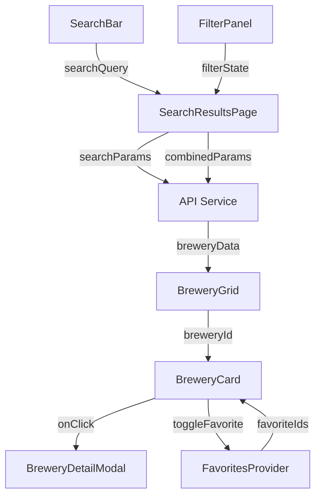
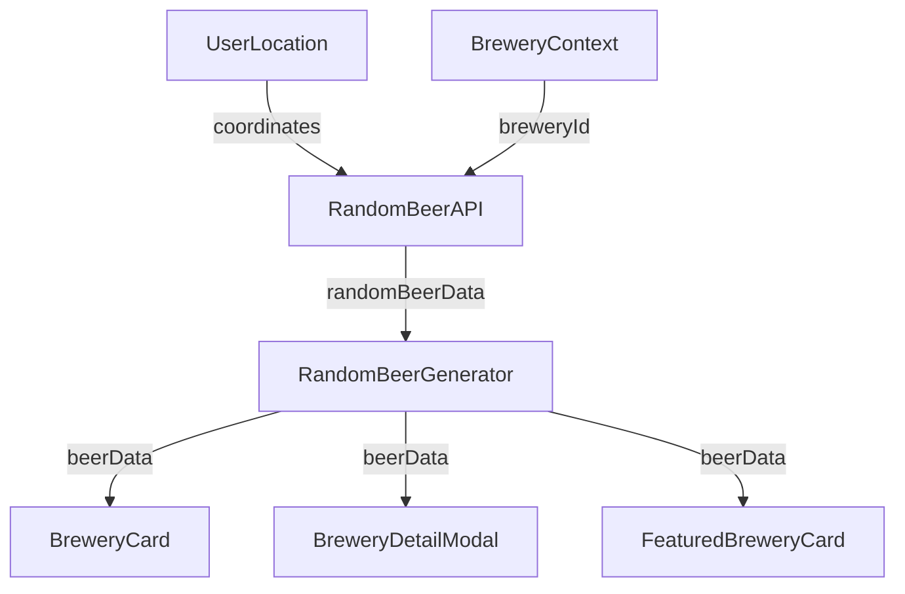

# Beer Finder App - Component Tree Structure

## Overview

This document provides a detailed component tree structure for the Beer Finder App based on the wireframe designs and mockups. The architecture prioritizes the specific design patterns shown in the wireframes, emphasizing mobile-first responsive design, random beer feature integration, modal patterns, and the favorites system.

## Component Hierarchy Tree

```
App (RootLayout)
├── AppProviders
│   ├── FavoritesProvider
│   ├── ThemeProvider
│   └── SearchStateProvider
├── ResponsiveLayout
│   ├── MobileLayout (< 768px)
│   │   ├── MobileHeader
│   │   │   ├── HamburgerMenuButton
│   │   │   ├── AppLogo
│   │   │   └── HeaderActions
│   │   │       ├── FavoritesIcon (with count badge)
│   │   │       └── ThemeToggle
│   │   ├── MobileNavigation (slide-out drawer)
│   │   │   ├── NavigationMenu
│   │   │   ├── UserPreferences
│   │   │   └── AppInfo
│   │   ├── MainContent
│   │   └── MobileFooter (minimal)
│   └── DesktopLayout (≥ 768px)
│       ├── DesktopHeader
│       │   ├── AppLogo
│       │   ├── PrimaryNavigation
│       │   └── HeaderActions
│       │       ├── FavoritesButton (with count)
│       │       ├── ThemeToggle
│       │       └── UserProfile
│       ├── MainContent
│       └── DesktopFooter
├── PageContainer
│   ├── HomePage
│   │   ├── HeroSection
│   │   │   ├── HeroContent
│   │   │   │   ├── HeroTitle
│   │   │   │   ├── HeroSubtitle
│   │   │   │   └── HeroDescription
│   │   │   ├── PrimarySearchBar
│   │   │   │   ├── SearchInput
│   │   │   │   ├── SearchIcon
│   │   │   │   ├── SearchSuggestions
│   │   │   │   └── ClearButton
│   │   │   └── LocationFilterQuick
│   │   │       ├── LocationIcon
│   │   │       ├── CurrentLocationDisplay
│   │   │       └── LocationChangeButton
│   │   ├── QuickActionsSection
│   │   │   ├── RandomBreweryAction
│   │   │   │   ├── ActionIcon
│   │   │   │   ├── ActionTitle
│   │   │   │   ├── ActionDescription
│   │   │   │   └── ActionButton
│   │   │   └── NearMeAction
│   │   │       ├── ActionIcon
│   │   │       ├── ActionTitle
│   │   │       ├── ActionDescription
│   │   │       └── LocationPermissionButton
│   │   ├── FeaturedBrewerySection
│   │   │   ├── SectionHeader
│   │   │   └── FeaturedBreweryCard
│   │   │       ├── BreweryImage
│   │   │       ├── BreweryName
│   │   │       ├── BreweryType
│   │   │       ├── BreweryLocation
│   │   │       ├── BreweryDescription
│   │   │       ├── RandomBeerSpotlight
│   │   │       │   ├── BeerImage
│   │   │       │   ├── BeerName
│   │   │       │   └── BeerABV
│   │   │       └── FeaturedActions
│   │   │           ├── FavoriteButton
│   │   │           ├── DirectionsButton
│   │   │           └── ViewDetailsButton
│   │   └── RecentSearchesSection
│   │       ├── SectionHeader
│   │       └── RecentSearchList
│   │           └── RecentSearchItem[]
│   │               ├── SearchQuery
│   │               ├── ResultCount
│   │               └── ShowResultsButton
│   ├── SearchResultsPage
│   │   ├── SearchHeader
│   │   │   ├── BackButton (mobile)
│   │   │   ├── PrimarySearchBar (shared component)
│   │   │   ├── FilterToggleButton (mobile)
│   │   │   └── ViewOptionsToggle
│   │   │       ├── GridViewButton
│   │   │       └── ListViewButton
│   │   ├── SearchResultsLayout
│   │   │   ├── FilterSidebar (desktop) / FilterModal (mobile)
│   │   │   │   ├── FilterHeader
│   │   │   │   │   ├── FilterTitle
│   │   │   │   │   └── CloseButton (mobile)
│   │   │   │   ├── BreweryTypeFilter
│   │   │   │   │   ├── FilterSectionTitle
│   │   │   │   │   └── BreweryTypeCheckboxGroup
│   │   │   │   │       └── TypeCheckbox[]
│   │   │   │   │           ├── CheckboxInput
│   │   │   │   │           ├── TypeLabel
│   │   │   │   │           └── TypeCount
│   │   │   │   ├── LocationFilter
│   │   │   │   │   ├── FilterSectionTitle
│   │   │   │   │   ├── LocationSearchInput
│   │   │   │   │   │   ├── SearchIcon
│   │   │   │   │   │   ├── LocationInput
│   │   │   │   │   │   └── LocationSuggestions
│   │   │   │   │   └── SelectedLocationsList
│   │   │   │   │       └── LocationChip[]
│   │   │   │   │           ├── LocationName
│   │   │   │   │           └── RemoveButton
│   │   │   │   ├── DistanceFilter
│   │   │   │   │   ├── FilterSectionTitle
│   │   │   │   │   ├── DistanceSlider
│   │   │   │   │   │   ├── SliderTrack
│   │   │   │   │   │   ├── SliderHandle
│   │   │   │   │   │   └── DistanceDisplay
│   │   │   │   │   └── DistancePresets
│   │   │   │   │       └── DistancePresetButton[]
│   │   │   │   ├── SortOptionsFilter
│   │   │   │   │   ├── FilterSectionTitle
│   │   │   │   │   └── SortRadioGroup
│   │   │   │   │       └── SortOption[]
│   │   │   │   │           ├── RadioInput
│   │   │   │   │           └── SortLabel
│   │   │   │   └── FilterActions
│   │   │   │       ├── ClearAllButton
│   │   │   │       └── ApplyFiltersButton
│   │   │   └── ResultsContent
│   │   │       ├── ResultsHeader
│   │   │       │   ├── ResultsCount
│   │   │       │   ├── SortDropdown (mobile)
│   │   │       │   └── ResultsRange
│   │   │       ├── BreweryGrid
│   │   │       │   ├── GridContainer
│   │   │       │   │   └── BreweryCard[]
│   │   │       │   │       ├── BreweryImage
│   │   │       │   │       ├── BreweryContent
│   │   │       │   │       │   ├── BreweryName
│   │   │       │   │       │   ├── BreweryType
│   │   │       │   │       │   ├── BreweryLocation
│   │   │       │   │       │   └── RandomBeerPreview
│   │   │       │   │       │       ├── BeerLabel
│   │   │       │   │       │       ├── BeerImage
│   │   │       │   │       │       ├── BeerName
│   │   │       │   │       │       └── BeerABV
│   │   │       │   │       └── BreweryActions
│   │   │       │   │           ├── FavoriteToggleButton
│   │   │       │   │           ├── DirectionsButton
│   │   │       │   │           └── ViewDetailsButton
│   │   │       │   └── LoadingSkeletons
│   │   │       │       └── BreweryCardSkeleton[]
│   │   │       └── LoadMoreSection
│   │   │           ├── LoadMoreButton
│   │   │           └── PaginationControls
│   │   │               ├── PageNumbers
│   │   │               ├── PrevButton
│   │   │               └── NextButton
│   ├── BreweryDetailModal (mobile) / BreweryDetailPage (desktop)
│   │   ├── ModalHeader (mobile)
│   │   │   ├── CloseButton
│   │   │   └── ModalTitle
│   │   ├── BackNavigation (desktop)
│   │   │   ├── BackButton
│   │   │   └── ShareButton
│   │   ├── BreweryDetailContent
│   │   │   ├── BreweryHeroSection
│   │   │   │   ├── BreweryHeroImage
│   │   │   │   └── BreweryHeroOverlay
│   │   │   │       ├── BreweryName
│   │   │   │       ├── BreweryType
│   │   │   │       └── BreweryRating (if available)
│   │   │   │           ├── StarRating
│   │   │   │           ├── RatingScore
│   │   │   │           └── ReviewCount
│   │   │   ├── BreweryInfoGrid
│   │   │   │   ├── ContactSection
│   │   │   │   │   ├── SectionTitle
│   │   │   │   │   ├── AddressDisplay
│   │   │   │   │   │   ├── AddressIcon
│   │   │   │   │   │   ├── AddressLines
│   │   │   │   │   │   └── AddressActions
│   │   │   │   │   ├── PhoneDisplay
│   │   │   │   │   │   ├── PhoneIcon
│   │   │   │   │   │   ├── PhoneNumber
│   │   │   │   │   │   └── CallButton
│   │   │   │   │   └── WebsiteDisplay
│   │   │   │   │       ├── WebsiteIcon
│   │   │   │   │       ├── WebsiteURL
│   │   │   │   │       └── VisitWebsiteButton
│   │   │   │   ├── RandomBeerSpotlight
│   │   │   │   │   ├── SectionTitle
│   │   │   │   │   ├── BeerSpotlightCard
│   │   │   │   │   │   ├── BeerImage
│   │   │   │   │   │   ├── BeerInfo
│   │   │   │   │   │   │   ├── BeerName
│   │   │   │   │   │   │   ├── BeerType
│   │   │   │   │   │   │   ├── BeerABV
│   │   │   │   │   │   │   └── BeerDescription
│   │   │   │   │   │   └── BeerActions
│   │   │   │   │   │       ├── RefreshRandomBeer
│   │   │   │   │   │       └── ShareBeerButton
│   │   │   │   │   └── RandomBeerGenerator
│   │   │   │   └── QuickActionsSection
│   │   │   │       ├── FavoriteAction
│   │   │   │       │   ├── FavoriteIcon
│   │   │   │       │   └── FavoriteLabel
│   │   │   │       ├── DirectionsAction
│   │   │   │       │   ├── DirectionsIcon
│   │   │   │       │   └── DirectionsLabel
│   │   │   │       ├── ShareAction
│   │   │   │       │   ├── ShareIcon
│   │   │   │       │   └── ShareLabel
│   │   │   │       └── PlanVisitAction
│   │   │   │           ├── CalendarIcon
│   │   │   │           └── PlanVisitLabel
│   │   │   └── RelatedBreweriesSection (desktop)
│   │       ├── SectionTitle
│   │       ├── RelatedBreweriesSlider
│   │       │   ├── SliderContainer
│   │       │   │   └── RelatedBreweryCard[]
│   │       │   ├── SliderNavigation
│   │       │   │   ├── PrevSlideButton
│   │       │   │   └── NextSlideButton
│   │       │   └── SliderIndicators
│   │       └── ViewAllRelatedButton
│   ├── FavoritesPage
│   │   ├── FavoritesHeader
│   │   │   ├── PageTitle
│   │   │   ├── FavoritesCount
│   │   │   └── FavoritesActions
│   │   │       ├── SearchFavoritesButton
│   │   │       └── SettingsButton
│   │   ├── FavoritesContent
│   │   │   ├── FavoritesGrid
│   │   │   │   └── FavoriteBreweryCard[]
│   │   │   │       ├── BreweryImage
│   │   │   │       ├── BreweryContent
│   │   │   │       │   ├── BreweryName
│   │   │   │       │   ├── BreweryType
│   │   │   │       │   ├── BreweryLocation
│   │   │   │       │   ├── DateAdded
│   │   │   │       │   └── RandomBeerPreview
│   │   │   │       └── FavoriteActions
│   │   │   │           ├── RemoveFromFavoritesButton
│   │   │   │           ├── DirectionsButton
│   │   │   │           └── ViewDetailsButton
│   │   │   └── EmptyFavoritesState
│   │   │       ├── EmptyStateIcon
│   │   │       ├── EmptyStateMessage
│   │   │       └── DiscoverBreweriesButton
│   │   └── FavoritesActions
│   │       ├── ShareFavoritesButton
│   │       └── ExportCalendarButton
│   └── RandomDiscoveryPage
│       ├── DiscoveryHeader
│       │   ├── PageTitle
│       │   └── DiscoverySettings
│       │       ├── LocationPreference
│       │       └── BreweryTypePreference
│       ├── RandomBrewerySpotlight
│       │   ├── BrewerySpotlightCard
│       │   │   ├── BreweryImage
│       │   │   ├── BreweryInfo
│       │   │   │   ├── BreweryName
│       │   │   │   ├── BreweryType
│       │   │   │   ├── BreweryLocation
│       │   │   │   └── BreweryDescription
│       │   │   ├── RandomBeerFeature
│       │   │   │   ├── BeerImage
│       │   │   │   ├── BeerName
│       │   │   │   ├── BeerABV
│       │   │   │   └── BeerDescription
│       │   │   └── SpotlightActions
│       │   │       ├── FavoriteButton
│       │   │       ├── ViewDetailsButton
│       │   │       ├── DirectionsButton
│       │   │       └── ShareButton
│       │   └── DiscoveryActions
│       │       ├── GetAnotherRandomButton
│       │       ├── NearMeRandomButton
│       │       └── DiscoveryHistoryButton
│       └── DiscoveryHistorySection
│           ├── SectionTitle
│           ├── HistoryList
│           │   └── HistoryItem[]
│           │       ├── BreweryName
│           │       ├── DiscoveryDate
│           │       └── RevisitButton
│           └── ClearHistoryButton
└── GlobalComponents
    ├── ModalSystem
    │   ├── ModalOverlay
    │   ├── ModalContainer
    │   │   ├── ModalContent
    │   │   └── ModalActions
    │   └── ModalBackdrop
    ├── ToastNotificationSystem
    │   ├── ToastContainer
    │   └── Toast[]
    │       ├── ToastIcon
    │       ├── ToastMessage
    │       └── ToastDismissButton
    ├── LoadingSystem
    │   ├── GlobalLoadingSpinner
    │   ├── PageTransitionLoader
    │   └── ComponentLoadingStates
    ├── ErrorBoundarySystem
    │   ├── GlobalErrorBoundary
    │   ├── ComponentErrorBoundary
    │   └── ErrorFallbackComponent
    │       ├── ErrorIcon
    │       ├── ErrorMessage
    │       ├── ErrorDetails
    │       └── RetryButton
    └── AccessibilityHelpers
        ├── SkipToContentLink
        ├── ScreenReaderAnnouncer
        └── FocusManagement
```

## Component Breakdown by Screen/Page

### 1. Homepage Components

#### Mobile Layout (320px - 767px)
- **MobileHeader**: Fixed header with hamburger menu, logo, and action buttons
- **HeroSection**: Prominent search interface with location context
- **QuickActionsSection**: Two-column grid with Random Brewery and Near Me actions
- **FeaturedBrewerySection**: Single featured brewery with random beer integration
- **RecentSearchesSection**: List of recent search queries

#### Desktop Layout (768px+)
- **DesktopHeader**: Horizontal navigation with logo, menu, and user actions
- **HeroSection**: Expanded hero with enhanced search and filter options
- **QuickActionsSection**: Side-by-side actions with more detailed descriptions
- **FeaturedBrewerySection**: Enhanced card with additional content and actions
- **RecentSearchesSection**: Horizontal layout with quick access buttons

### 2. Search Results Components

#### Mobile Layout
- **SearchHeader**: Back button, search bar, and filter toggle
- **FilterModal**: Full-screen overlay with all filter options
- **BreweryGrid**: Single-column card layout with random beer previews
- **LoadMoreSection**: Simple load more button with pagination

#### Desktop Layout
- **SearchHeader**: Integrated search bar with view options
- **FilterSidebar**: Persistent sidebar with collapsible filter sections
- **BreweryGrid**: Multi-column responsive grid (2-4 columns)
- **LoadMoreSection**: Enhanced pagination with page numbers

### 3. Brewery Detail Components

#### Mobile Implementation (Modal)
- **BreweryDetailModal**: Full-screen modal with scroll capability
- **ModalHeader**: Close button and title
- **BreweryDetailContent**: Scrollable content with hero, info, and actions
- **RandomBeerSpotlight**: Integrated random beer feature

#### Desktop Implementation (Page)
- **BreweryDetailPage**: Dedicated page with back navigation
- **BreweryHeroSection**: Full-width hero image with overlay
- **BreweryInfoGrid**: Three-column layout (contact, beer spotlight, actions)
- **RelatedBreweriesSection**: Horizontal slider with related breweries

### 4. Filter Panel Components

#### Mobile (Modal Implementation)
- **FilterModal**: Full-screen overlay with header and actions
- **FilterSections**: Stacked sections with touch-friendly controls
- **FilterActions**: Fixed bottom bar with clear and apply buttons

#### Desktop (Sidebar Implementation)
- **FilterSidebar**: Fixed sidebar with sticky positioning
- **FilterSections**: Collapsible sections with compact controls
- **FilterActions**: Integrated actions within each section

### 5. Favorites Page Components

#### Shared Layout
- **FavoritesHeader**: Page title, count, and management actions
- **FavoritesGrid**: Responsive grid of favorited breweries
- **FavoriteBreweryCard**: Enhanced brewery card with removal options
- **EmptyFavoritesState**: Encouraging state when no favorites exist
- **FavoritesActions**: Share and export functionality

## Responsive Component Variants & Breakpoints

### Breakpoint Strategy

| Breakpoint | Width Range | Layout Pattern | Grid Columns | Component Behavior |
|------------|-------------|----------------|--------------|-------------------|
| **Mobile** | 320px - 767px | Single column, stacked | 1 column | Modal overlays, hamburger menu |
| **Tablet** | 768px - 1023px | Two-column hybrid | 2 columns | Sidebar filters, expanded cards |
| **Desktop** | 1024px - 1439px | Multi-column layout | 3-4 columns | Full sidebar, hover effects |
| **Large Desktop** | 1440px+ | Constrained width | 4+ columns | Maximum content width, enhanced spacing |

### Component Responsive Variations

#### SearchBar Component
- **Mobile**: Full-width with icon, simple input
- **Desktop**: Enhanced with autocomplete, advanced search button

#### BreweryCard Component
- **Mobile**: Compact vertical layout, minimal actions
- **Tablet**: Expanded with more content, horizontal beer preview
- **Desktop**: Full feature set with hover effects and animations

#### Filter Components
- **Mobile**: Modal overlay, full-screen, touch-optimized
- **Desktop**: Sidebar panel, always visible, mouse-optimized

#### Navigation Components
- **Mobile**: Hamburger menu with slide-out drawer
- **Desktop**: Horizontal navigation with dropdown menus

## State Management Mapping

### Component State Types

#### Local Component State (useState)
```typescript
// UI-specific state that doesn't need to be shared
interface ComponentLocalState {
  isOpen: boolean;           // Modal/dropdown open state
  isLoading: boolean;        // Component loading state
  inputValue: string;        // Form input values
  selectedIndex: number;     // Selection state
  isHovered: boolean;        // Hover state (desktop)
}
```

#### URL State (Next.js Router)
```typescript
// Shareable and bookmarkable state
interface URLState {
  searchQuery: string;       // Current search query
  filters: FilterState;      // Active filter selections
  page: number;             // Pagination state
  sortBy: SortOption;       // Sort preferences
  view: 'grid' | 'list';    // View mode preference
}
```

#### Global Application State (Context)
```typescript
// App-wide state that persists across pages
interface GlobalState {
  favorites: BreweryId[];           // User's favorite breweries
  theme: 'light' | 'dark';          // Theme preference
  location: GeolocationData;        // User's location context
  recentSearches: SearchHistory[];  // Search history
  userPreferences: UserSettings;    // App preferences
}
```

#### Server State (API Data)
```typescript
// Data fetched from external APIs
interface ServerState {
  breweries: Brewery[];             // Brewery search results
  breweryDetails: BreweryDetail;    // Individual brewery data
  randomBeer: RandomBeerData;       // Random beer information
  searchSuggestions: string[];      // Search autocomplete
  locationSuggestions: Location[];  // Location autocomplete
}
```

### State Management Patterns by Component

#### Search Components
- **SearchBar**: Local state for input, URL state for queries
- **FilterPanel**: Local state for UI, URL state for applied filters
- **BreweryGrid**: Server state for results, local state for view preferences

#### Discovery Components
- **RandomBrewery**: Server state for brewery data, local state for loading
- **FeaturedBrewery**: Server state + cache for daily brewery selection

#### User Preference Components
- **FavoritesSystem**: Global state for favorites list, local storage persistence
- **ThemeToggle**: Global state for theme, local storage persistence

## Component Props & Data Flow Specifications

### Search Flow Data Architecture



### Random Beer Feature Integration



### Component Prop Interfaces

#### BreweryCard Props
```typescript
interface BreweryCardProps {
  brewery: Brewery;
  variant: 'compact' | 'standard' | 'featured';
  showRandomBeer: boolean;
  onFavoriteToggle: (breweryId: string) => void;
  onViewDetails: (breweryId: string) => void;
  onGetDirections: (address: string) => void;
  isFavorited: boolean;
  randomBeerData?: RandomBeerData;
  className?: string;
}
```

#### SearchBar Props
```typescript
interface SearchBarProps {
  placeholder: string;
  initialValue?: string;
  onSearch: (query: string) => void;
  onSuggestionSelect: (suggestion: string) => void;
  showSuggestions: boolean;
  isLoading: boolean;
  variant: 'primary' | 'secondary';
  size: 'small' | 'medium' | 'large';
}
```

#### FilterPanel Props
```typescript
interface FilterPanelProps {
  activeFilters: FilterState;
  onFilterChange: (filters: FilterState) => void;
  onClearAll: () => void;
  onApplyFilters: () => void;
  resultCount: number;
  isVisible: boolean;
  onClose: () => void;
  variant: 'modal' | 'sidebar';
}
```

## Reusable Component Identification & Abstraction

### Core Reusable Components

#### 1. Interactive Elements
- **Button**: Unified button component with variants, sizes, and states
- **Input**: Consistent input styling with validation and accessibility
- **IconButton**: Icon-only buttons with consistent sizing and interactions
- **Toggle**: Switch/toggle component for preferences and filters

#### 2. Layout Components
- **Card**: Flexible card component with header, content, and action areas
- **Grid**: Responsive grid system with auto-sizing and gap controls
- **Stack**: Vertical and horizontal stacking with consistent spacing
- **Container**: Content containers with responsive width and padding

#### 3. Data Display Components
- **Avatar**: User and brewery image display with fallbacks
- **Badge**: Count badges, status indicators, and labels
- **Tag**: Removable tags for filters and categories
- **Rating**: Star ratings and review displays

#### 4. Feedback Components
- **Skeleton**: Loading placeholder components
- **Empty State**: Consistent empty state messaging and actions
- **Error Display**: Error messages with retry functionality
- **Success Message**: Confirmation and success feedback

#### 5. Navigation Components
- **Breadcrumb**: Navigation hierarchy display
- **Pagination**: Page navigation with numbers and arrows
- **Tabs**: Tab navigation for content sections
- **Stepper**: Multi-step process navigation

### Component Abstraction Patterns

#### Base Component Pattern
```typescript
// Base component with common props and behavior
interface BaseComponentProps {
  className?: string;
  children?: React.ReactNode;
  variant?: string;
  size?: 'small' | 'medium' | 'large';
  disabled?: boolean;
  loading?: boolean;
}
```

#### Compound Component Pattern
```typescript
// Complex components broken into sub-components
const BreweryCard = {
  Root: BreweryCardRoot,
  Image: BreweryCardImage,
  Content: BreweryCardContent,
  Header: BreweryCardHeader,
  Body: BreweryCardBody,
  Actions: BreweryCardActions,
  RandomBeer: BreweryCardRandomBeer
};
```

#### Polymorphic Component Pattern
```typescript
// Components that can render as different HTML elements
interface PolymorphicProps<T extends React.ElementType> {
  as?: T;
  children: React.ReactNode;
}
```

## Component Composition Patterns

### 1. Compound Components

#### FilterPanel Composition
```typescript
<FilterPanel>
  <FilterPanel.Header>
    <FilterPanel.Title>Filters</FilterPanel.Title>
    <FilterPanel.CloseButton />
  </FilterPanel.Header>
  <FilterPanel.Content>
    <FilterSection title="Brewery Type">
      <CheckboxGroup options={breweryTypes} />
    </FilterSection>
    <FilterSection title="Location">
      <LocationSearch />
    </FilterSection>
  </FilterPanel.Content>
  <FilterPanel.Actions>
    <FilterPanel.ClearButton />
    <FilterPanel.ApplyButton />
  </FilterPanel.Actions>
</FilterPanel>
```

#### BreweryCard Composition
```typescript
<BreweryCard>
  <BreweryCard.Image src={brewery.image} alt={brewery.name} />
  <BreweryCard.Content>
    <BreweryCard.Header>
      <BreweryCard.Name>{brewery.name}</BreweryCard.Name>
      <BreweryCard.Type>{brewery.type}</BreweryCard.Type>
    </BreweryCard.Header>
    <BreweryCard.Location>{brewery.location}</BreweryCard.Location>
    <BreweryCard.RandomBeer beer={randomBeer} />
  </BreweryCard.Content>
  <BreweryCard.Actions>
    <FavoriteButton />
    <DirectionsButton />
    <ViewDetailsButton />
  </BreweryCard.Actions>
</BreweryCard>
```

### 2. Render Props Pattern

#### SearchSuggestions Component
```typescript
<SearchWithSuggestions
  render={({ suggestions, isLoading, onSuggestionSelect }) => (
    <div>
      <SearchInput onSearch={handleSearch} />
      {isLoading && <LoadingSpinner />}
      <SuggestionsList 
        suggestions={suggestions}
        onSelect={onSuggestionSelect}
      />
    </div>
  )}
/>
```

### 3. Higher-Order Components (HOCs)

#### withFavorites HOC
```typescript
const withFavorites = <P extends object>(
  Component: React.ComponentType<P>
) => {
  return (props: P) => {
    const { favorites, toggleFavorite } = useFavorites();
    
    return (
      <Component
        {...props}
        favorites={favorites}
        onToggleFavorite={toggleFavorite}
      />
    );
  };
};
```

#### withRandomBeer HOC
```typescript
const withRandomBeer = <P extends object>(
  Component: React.ComponentType<P>
) => {
  return (props: P & { breweryId: string }) => {
    const randomBeer = useRandomBeer(props.breweryId);
    
    return (
      <Component
        {...props}
        randomBeer={randomBeer}
      />
    );
  };
};
```

### 4. Custom Hook Patterns

#### useBreweryActions Hook
```typescript
const useBreweryActions = (brewery: Brewery) => {
  const { addToFavorites, removeFromFavorites, isFavorited } = useFavorites();
  const { getDirections } = useNavigation();
  const { shareBrewery } = useSharing();
  
  return {
    toggleFavorite: () => isFavorited(brewery.id) 
      ? removeFromFavorites(brewery.id)
      : addToFavorites(brewery),
    getDirections: () => getDirections(brewery.address),
    share: () => shareBrewery(brewery),
    isFavorited: isFavorited(brewery.id)
  };
};
```

#### useResponsive Hook
```typescript
const useResponsive = () => {
  const [breakpoint, setBreakpoint] = useState<Breakpoint>('mobile');
  
  useEffect(() => {
    const handleResize = () => {
      const width = window.innerWidth;
      if (width < 768) setBreakpoint('mobile');
      else if (width < 1024) setBreakpoint('tablet');
      else if (width < 1440) setBreakpoint('desktop');
      else setBreakpoint('large');
    };
    
    handleResize();
    window.addEventListener('resize', handleResize);
    return () => window.removeEventListener('resize', handleResize);
  }, []);
  
  return {
    breakpoint,
    isMobile: breakpoint === 'mobile',
    isTablet: breakpoint === 'tablet',
    isDesktop: breakpoint === 'desktop' || breakpoint === 'large',
    isLarge: breakpoint === 'large'
  };
};
```

### 5. Context-Based Composition

#### Theme Context Integration
```typescript
<ThemeProvider>
  <FavoritesProvider>
    <SearchStateProvider>
      <App />
    </SearchStateProvider>
  </FavoritesProvider>
</ThemeProvider>
```

#### Component Context Usage
```typescript
const BreweryCard = () => {
  const { theme } = useTheme();
  const { favorites, toggleFavorite } = useFavorites();
  const { addToSearchHistory } = useSearchState();
  
  return (
    <Card className={`brewery-card brewery-card--${theme}`}>
      {/* Component content */}
    </Card>
  );
};
```

---

## Implementation Priority

### Phase 1: Foundation Components
1. **Layout System** (ResponsiveLayout, Header, Footer)
2. **Base Components** (Button, Input, Card, Grid)
3. **Search Infrastructure** (SearchBar, SearchResults)

### Phase 2: Feature Components
1. **Brewery Display** (BreweryCard, BreweryGrid, BreweryDetail)
2. **Filter System** (FilterPanel, FilterComponents)
3. **Random Beer Integration** (RandomBeerGenerator, BeerSpotlight)

### Phase 3: Advanced Features
1. **Favorites System** (FavoritesProvider, FavoritesPage)
2. **Modal System** (ModalOverlay, ResponsiveModals)
3. **Navigation & State** (URL state management, history)

### Phase 4: Polish & Optimization
1. **Loading & Error States** (Skeletons, ErrorBoundaries)
2. **Animations & Transitions** (Page transitions, hover effects)
3. **Accessibility & Performance** (ARIA labels, lazy loading)

---

This component tree structure provides a comprehensive foundation for implementing the Beer Finder App that perfectly aligns with the wireframe designs while maintaining scalability, reusability, and responsive design principles.